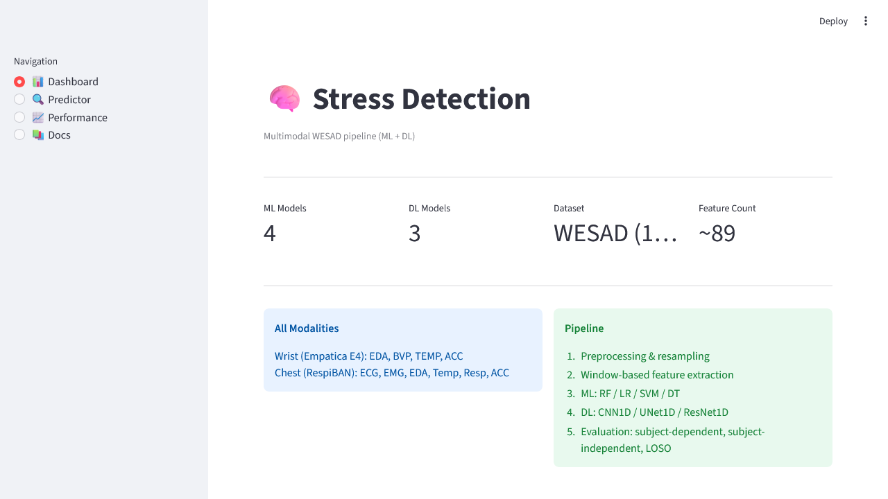

# Đánh Giá Repository `xanhhangreal/TotNghiep`

**Repository:** <https://github.com/xanhhangreal/TotNghiep>  
**Ngày kiểm tra:** 2026-05-12  
**Chủ đề:** Phát hiện trạng thái căng thẳng từ tín hiệu sinh lý đa phương thức bằng học máy và học sâu  
**Đánh giá tổng quan:** **7/10**

> Nhận xét ngắn: Repo có nền tảng khá tốt cho đồ án tốt nghiệp/OJT, có pipeline tương đối đầy đủ từ dữ liệu, tiền xử lý, huấn luyện, giải thích mô hình đến demo. Tuy nhiên, cần cải thiện tính tái lập, bổ sung kết quả thực nghiệm có thể kiểm chứng và tăng độ hoàn thiện khi trình bày.

---

## 1. Tổng Quan Dự Án

Repo tập trung vào bài toán phát hiện stress từ dữ liệu sinh lý đa phương thức, chủ yếu dựa trên tập dữ liệu **WESAD**. Dự án hỗ trợ:

- Phân loại nhị phân: `Relaxed / Stressed`.
- Phân loại 3 lớp: `Baseline / Stress / Amusement`.
- Dữ liệu từ thiết bị cổ tay và ngực:
  - Empatica E4: EDA, BVP, TEMP, ACC.
  - RespiBAN: ECG, EMG, EDA, Temp, Resp, ACC.
- Mô hình học máy:
  - Random Forest.
  - Logistic Regression.
  - SVM.
  - Decision Tree.
- Mô hình học sâu:
  - CNN-1D.
  - UNet-1D.
  - ResNet-1D.
- Demo bằng Streamlit.
- Phân tích giải thích mô hình bằng SHAP.

Dataset WESAD phù hợp với đề tài vì có dữ liệu từ 15 người tham gia, gồm tín hiệu sinh lý và chuyển động từ thiết bị đeo cổ tay/ngực, đồng thời có các trạng thái cảm xúc/stress như baseline, stress và amusement.

---

## 2. Điểm Mạnh

### 2.1. Chủ Đề Có Giá Trị Nghiên Cứu

Bài toán phát hiện stress từ tín hiệu sinh lý là một hướng phù hợp cho đồ án vì:

- Có tính ứng dụng thực tế trong sức khỏe cá nhân và theo dõi trạng thái tinh thần.
- Có dataset chuẩn để đối chiếu kết quả.
- Có thể triển khai nhiều hướng: học máy truyền thống, học sâu, giải thích mô hình, demo ứng dụng.

### 2.2. README Khá Đầy Đủ

README đã mô tả được:

- Mục tiêu dự án.
- Cấu trúc thư mục.
- Cách cài đặt môi trường.
- Cách chuẩn bị dữ liệu WESAD.
- Cách chạy huấn luyện mô hình học máy và học sâu.
- Cách chạy demo Streamlit.
- Gợi ý triển khai bằng Docker hoặc Streamlit Community Cloud.

Đây là điểm cộng lớn vì người review có thể hiểu được dự án mà không cần đọc toàn bộ mã nguồn.

### 2.3. Có Nhiều Kiểu Đánh Giá Mô Hình

Repo hỗ trợ các kiểu đánh giá quan trọng:

- **Subject-dependent**: huấn luyện và kiểm thử có thể chứa dữ liệu từ cùng người.
- **Subject-independent**: kiểm tra khả năng tổng quát giữa các người khác nhau.
- **LOSO** — Leave-One-Subject-Out: mỗi lần để một người làm tập kiểm thử.

Trong bài toán tín hiệu sinh lý, LOSO rất quan trọng vì mô hình stress thường dễ học đặc điểm cá nhân thay vì học quy luật tổng quát.

### 2.4. Có SHAP Để Giải Thích Mô Hình

Việc có `shap_analysis.py` là điểm mạnh. SHAP giúp trả lời các câu hỏi như:

- Đặc trưng nào ảnh hưởng mạnh nhất đến dự đoán stress?
- Mô hình dựa nhiều vào EDA, BVP, ECG, TEMP hay ACC?
- Kết quả có hợp lý về mặt sinh lý học không?

Đây là phần rất hữu ích khi viết báo cáo hoặc bảo vệ đồ án.

### 2.5. Có Demo Streamlit

Repo có demo Streamlit với các phần như Dashboard, Predictor, Performance và Docs. Điều này giúp dự án không chỉ dừng ở code huấn luyện mà còn có sản phẩm trình diễn trực quan.

---

## 3. Vấn Đề Cần Cải Thiện

### 3.1. Tài Liệu Phụ Cần Duy Trì Vai Trò Redirect

Tại trạng thái hiện tại, `README_PROJECT.md` đã được đánh dấu **Deprecated** và chỉ dẫn rõ ràng rằng `README.md` là nguồn sự thật chính. Vì vậy, rủi ro "hai README mâu thuẫn nhau" đã giảm đáng kể.

**Lời khuyên:**

- Giữ `README_PROJECT.md` ngắn gọn như hiện tại (vai trò redirect).
- Tránh thêm lại cấu trúc thư mục legacy vào `README_PROJECT.md`.
- Nếu có thay đổi lớn, cập nhật duy nhất trong `README.md`.

---

### 3.2. Thiếu Kết Quả Thực Nghiệm Có Thể Kiểm Chứng

README nói kết quả được lưu trong `results/`, nhưng thư mục này thường bị bỏ qua bởi `.gitignore`, nên người review không thấy kết quả cụ thể.

Với đồ án tốt nghiệp, đây là điểm cần bổ sung gấp.

**Nên thêm thư mục tóm tắt kết quả:**

```text
results_summary/
├── ml_binary_loso_summary.csv
├── ml_3class_loso_summary.csv
├── dl_binary_loso_summary.csv
├── dl_3class_loso_summary.csv
└── figures/
    ├── confusion_matrix_rf_binary.png
    ├── confusion_matrix_resnet_3class.png
    └── shap_top_features.png
```

**Nên thêm bảng kết quả vào README:**

| Model | Task | Evaluation | Accuracy | F1-score | Ghi chú |
|---|---:|---|---:|---:|---|
| Random Forest | 2-class | LOSO | ... | ... | wrist/chest/both |
| SVM | 2-class | LOSO | ... | ... | ... |
| CNN-1D | 3-class | LOSO | ... | ... | ... |
| ResNet-1D | 3-class | LOSO | ... | ... | ... |

---

### 3.3. Cần Giải Thích Rõ Hơn Về Mô Hình Học Sâu

Trong repo, các mô hình CNN-1D, UNet-1D, ResNet-1D đang chạy trên vector đặc trưng đã trích xuất, không phải trực tiếp trên tín hiệu thô.

Điều này không sai, nhưng cần giải thích rõ để tránh bị hỏi khi bảo vệ:

- Vì sao dùng CNN-1D trên vector đặc trưng?
- Thứ tự đặc trưng có ý nghĩa không?
- Vì sao dùng UNet-1D, vốn thường dùng cho dữ liệu chuỗi hoặc phân đoạn tín hiệu?
- ResNet-1D có lợi thế gì so với MLP hoặc Random Forest trong trường hợp đầu vào là vector đặc trưng?

**Lời khuyên:**

Nên chia rõ mô hình thành các nhóm:

1. **Feature-based ML**  
   Random Forest, SVM, Logistic Regression, Decision Tree.

2. **Feature-based DL**  
   CNN-1D, UNet-1D, ResNet-1D trên vector đặc trưng.

3. **Raw-signal DL** — nếu có thời gian bổ sung  
   CNN/ResNet trực tiếp trên cửa sổ tín hiệu đã resample.

Nếu không bổ sung Raw-signal DL, cần ghi rõ trong báo cáo rằng mô hình học sâu hiện tại là học sâu trên đặc trưng đã trích xuất.

---

### 3.4. Repo Còn Ít Dấu Hiệu Hoàn Thiện Sản Phẩm

Repo hiện chưa có nhiều thông tin trình bày bên ngoài như:

- GitHub About chưa đầy đủ.
- Chưa có topics.
- Chưa có release.
- Chưa có ảnh demo giao diện.
- Chưa có badge trạng thái.

Điều này không làm sai thuật toán, nhưng ảnh hưởng đến ấn tượng khi review.

**Lời khuyên:**

Thêm phần About:

```text
Stress detection from multimodal physiological signals using machine learning and deep learning on WESAD dataset.
```

Thêm topics:

```text
stress-detection, wesad, physiological-signals, machine-learning, deep-learning, streamlit, shap
```

Nên tạo release:

```text
v1.0-thesis
```

Và thêm ảnh demo vào README:

```md
## Demo


```

---

### 3.5. Tài Liệu Tham Khảo PDF Có Thể Làm Repo Nặng

Repo có thư mục `references/` chứa tài liệu PDF. Việc này không sai, nhưng nếu thêm nhiều PDF lớn thì repo sẽ nặng và khó quản lý.

**Lời khuyên:**

- Chỉ giữ tài liệu thật sự cần thiết.
- Với bài báo có DOI/link chính thức, nên dẫn link trong README thay vì commit PDF.
- Nếu cần lưu nhiều tài liệu lớn, cân nhắc dùng Git LFS hoặc thư mục tài liệu ngoài repo.

---

## 4. Checklist Cải Thiện Theo Mức Ưu Tiên

### Mức 1 — Rất Nên Làm Trước Khi Nộp

- [x] Giữ `README_PROJECT.md` ở trạng thái deprecated và trỏ về `README.md`.
- [ ] Thêm bảng kết quả thực nghiệm vào README.
- [ ] Thêm ảnh confusion matrix.
- [ ] Thêm biểu đồ so sánh mô hình.
- [ ] Thêm hình SHAP top features.
- [x] Đã ghi phiên bản Python tối thiểu trong README (`Python 3.10+`).
- [ ] Thêm `LICENSE`.
- [ ] Thêm mô tả ngắn ở phần GitHub About.
- [ ] Thêm topics cho repository.

### Mức 2 — Nên Làm Nếu Còn Thời Gian

- [ ] Đưa `tests/` vào commit chính thức và bổ sung test cơ bản.
- [ ] Test các hàm chính:
  - loader dữ liệu.
  - tiền xử lý.
  - trích xuất đặc trưng.
  - chia tập train/test.
- [ ] Thêm `Makefile` hoặc script `run_all.sh`.
- [ ] Pin phiên bản thư viện trong `requirements.txt`.
- [ ] Thêm GitHub Actions để kiểm tra import/lint đơn giản.

### Mức 3 — Nâng Cao Chất Lượng Nghiên Cứu

- [ ] Thêm baseline học sâu trực tiếp trên tín hiệu thô.
- [ ] Làm ablation study:
  - wrist only.
  - chest only.
  - both.
- [ ] So sánh 2-class và 3-class rõ ràng.
- [ ] Phân tích lỗi theo từng subject.
- [ ] Thêm phần limitations trong README hoặc báo cáo.

---

## 5. Gợi Ý Cấu Trúc README Tốt Hơn

README nên có cấu trúc như sau:

```md
# Stress Detection From Multimodal Physiological Signals

## 1. Giới thiệu

## 2. Dataset

## 3. Phương pháp

### 3.1. Tiền xử lý
### 3.2. Trích xuất đặc trưng
### 3.3. Mô hình học máy
### 3.4. Mô hình học sâu
### 3.5. Giải thích mô hình bằng SHAP

## 4. Cài đặt

## 5. Cách chạy

### 5.1. Chuẩn bị dữ liệu
### 5.2. Huấn luyện ML
### 5.3. Huấn luyện DL
### 5.4. Chạy demo Streamlit

## 6. Kết quả thực nghiệm

## 7. Demo

## 8. Hạn chế

## 9. Tài liệu tham khảo
```

---

## 6. Đánh Giá Theo Tiêu Chí Đồ Án

| Tiêu chí | Điểm | Nhận xét |
|---|---:|---|
| Ý tưởng đề tài | 8.5/10 | Chủ đề tốt, có dataset chuẩn, có tính ứng dụng |
| README/tài liệu | 7.5/10 | README chính đầy đủ, README_PROJECT đã được đánh dấu deprecated |
| Code pipeline | 7/10 | Có loader, preprocessing, feature, training, DL, SHAP, app |
| Tính tái lập | 6.5/10 | Có hướng dẫn chạy nhưng thiếu kết quả mẫu và test |
| Phương pháp ML/DL | 7/10 | Đa dạng mô hình, nhưng phần DL cần giải thích kỹ hơn |
| Trình bày GitHub | 6.5/10 | Cần thêm About, topics, release, screenshot |
| Giá trị demo | 8/10 | Có Streamlit, phù hợp trình bày đồ án |

---

## 7. Kết Luận

Repo `TotNghiep` đã có nền tảng tốt cho một đồ án về phát hiện stress từ tín hiệu sinh lý. Điểm mạnh là có pipeline tương đối đầy đủ, có nhiều mô hình, có SHAP và có demo Streamlit. Tuy nhiên, để repo thuyết phục hơn khi nộp hoặc bảo vệ, cần ưu tiên:

1. Duy trì README là nguồn sự thật duy nhất và giữ tài liệu phụ ở dạng redirect.
2. Bổ sung kết quả thực nghiệm.
3. Thêm hình ảnh minh họa.
4. Giải thích rõ cách dùng học sâu trên vector đặc trưng.
5. Tăng tính tái lập bằng test, script chạy và phiên bản thư viện rõ ràng.

Nếu hoàn thiện các mục trên, repo có thể nâng từ khoảng **7/10** lên **8.5–9/10**.

---

## 8. Tài Liệu Tham Khảo

- Repository GitHub: <https://github.com/xanhhangreal/TotNghiep>
- WESAD dataset — UCI Machine Learning Repository: <https://archive.ics.uci.edu/dataset/465/wesad+wearable+stress+and+affect+detection>
- WESAD dataset — University of Siegen: <https://ubi29.informatik.uni-siegen.de/usi/data_wesad.html>
- Schmidt, P. et al. (2018). *Introducing WESAD, a Multimodal Dataset for Wearable Stress and Affect Detection*. ICMI 2018.
