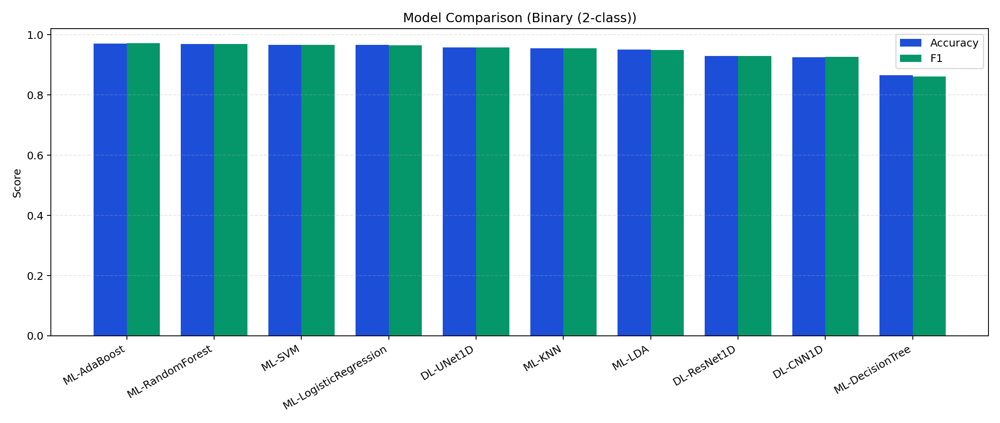
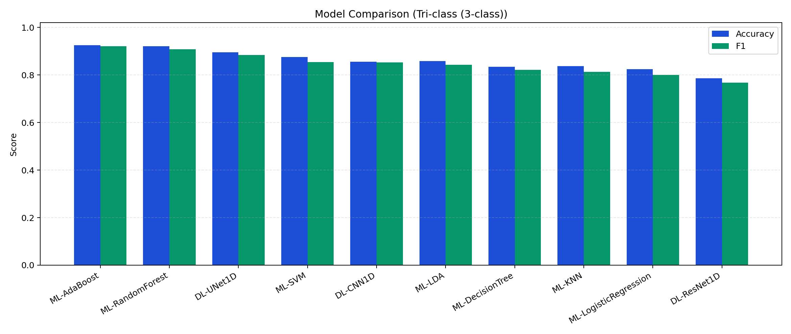
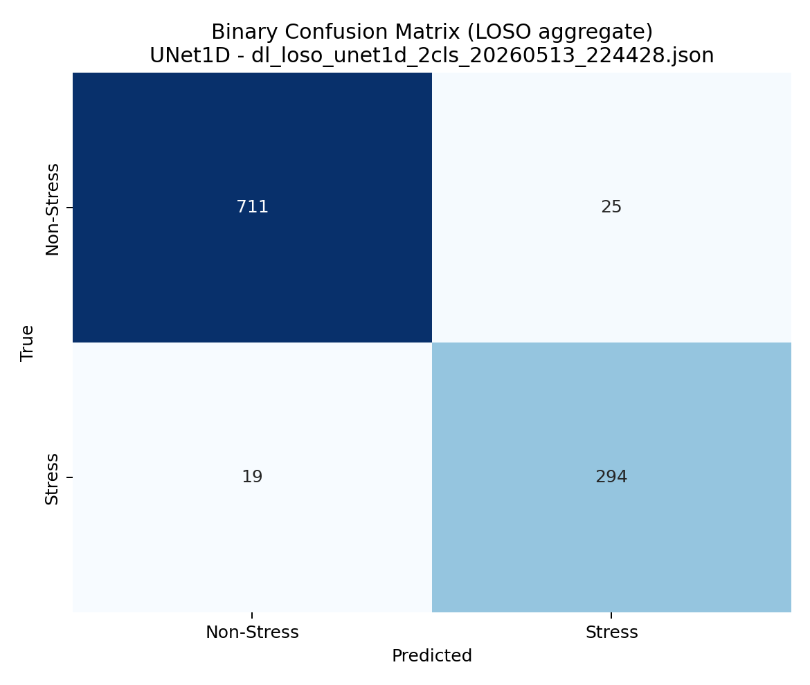
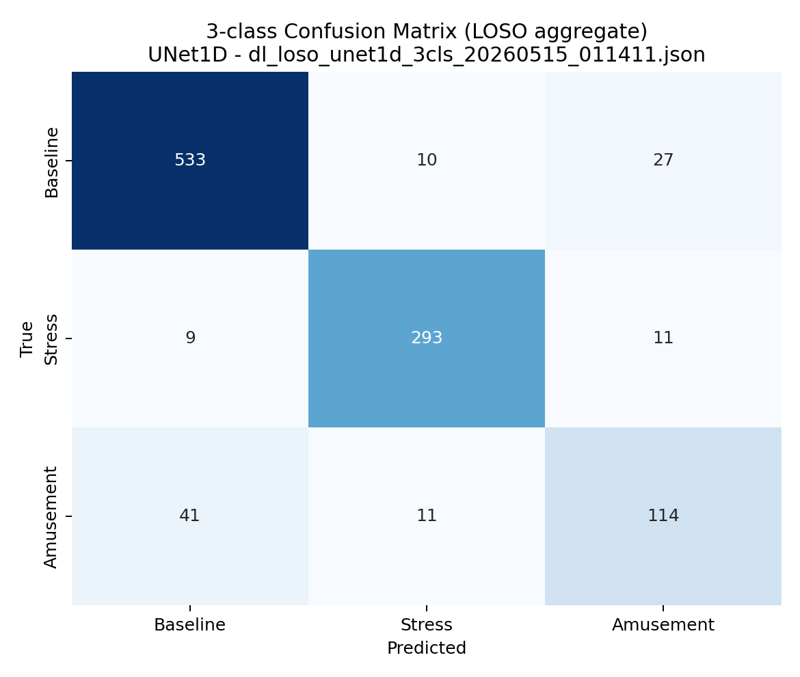
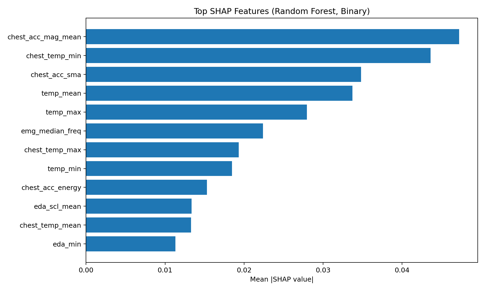

# Nghiên cứu phát hiện trạng thái căng thẳng từ tín hiệu sinh lý đa phương thức bằng học sâu

> **Stress Detection from Multimodal Physiological Signals Using Deep Learning**

Phân loại stress nhị phân (Relaxed / Stressed) và 3-class (Baseline / Stress /
Amusement) sử dụng tín hiệu sinh lý đa phương thức từ **cổ tay** (Empatica E4:
EDA, BVP, TEMP, ACC) và **ngực** (RespiBAN: ECG, EMG, EDA, Temp, Resp, ACC).

Đánh giá trên tập dữ liệu **WESAD** (Schmidt et al., 2018) với **mô hình học máy**
(Random Forest, Logistic Regression, SVM, Decision Tree, AdaBoost, LDA, KNN)
và **mô hình học sâu** (CNN-1D, UNet-1D, ResNet-1D).

---

## Mục lục

1. [Cấu trúc dự án](#cấu-trúc-dự-án)
2. [Yêu cầu hệ thống](#yêu-cầu-hệ-thống)
3. [Cài đặt môi trường](#cài-đặt-môi-trường)
4. [Chuẩn bị dữ liệu](#chuẩn-bị-dữ-liệu)
5. [Chạy huấn luyện mô hình](#chạy-huấn-luyện-mô-hình)
6. [Ghi chú phương pháp](#ghi-chú-phương-pháp)
7. [Kết quả thực nghiệm (LOSO)](#kết-quả-thực-nghiệm-loso)
8. [Chạy demo tùy chọn (Streamlit)](#chạy-demo-tùy-chọn-streamlit)
9. [Triển khai (Deploy)](#triển-khai-deploy)
10. [Hạn chế](#hạn-chế)
11. [Tài liệu tham khảo](#tài-liệu-tham-khảo)

---

## Cấu trúc dự án

```
├── README.md                 # Hướng dẫn sử dụng (file này)
├── requirements.txt          # Phụ thuộc cốt lõi (phục vụ thực nghiệm/báo cáo)
├── requirements-demo.txt     # Phụ thuộc tùy chọn cho demo Streamlit
├── .gitignore
│
├── src/                      # MÃ NGUỒN
│   ├── config.py             # Cấu hình đường dẫn, hằng số, siêu tham số
│   ├── wesad_loader.py       # Đọc dữ liệu WESAD (pickle), căn chỉnh tín hiệu
│   ├── preprocessing.py      # Tiền xử lý tín hiệu (lọc, resample, chuẩn hóa)
│   ├── features.py           # Trích xuất ~70 đặc trưng từ tất cả phương thức
│   ├── ml_models.py          # Bọc mô hình sklearn (RF, LR, SVM, DT, AdaBoost, LDA, KNN)
│   ├── dl_models.py          # Kiến trúc PyTorch (CNN-1D, UNet-1D, ResNet-1D)
│   ├── training.py           # Pipeline huấn luyện ML (CLI)
│   ├── dl_training.py        # Pipeline huấn luyện DL (CLI)
│   ├── raw_signal.py         # Tạo cửa sổ tín hiệu thô đa kênh cho DL baseline
│   ├── raw_dl_training.py    # Baseline DL học trực tiếp trên raw signals (LOSO)
│   ├── build_results_summary.py  # Tổng hợp bảng/biểu đồ benchmark từ JSON
│   ├── build_device_ablation_summary.py  # Tổng hợp ablation theo device
│   ├── shap_analysis.py      # Phân tích SHAP
│   ├── app.py                # Ứng dụng demo Streamlit (tùy chọn)
│   ├── setup_wesad.py        # Script tải & xác minh WESAD
│   └── notebooks/
│       └── 01_data_exploration.ipynb
│
├── data/                     # Dữ liệu (gitignored)
│   └── WESAD/
│       ├── S2/S2.pkl
│       ├── S3/S3.pkl
│       └── ...               # S2–S17 (trừ S1, S12)
│
├── models/                   # Mô hình đã lưu (gitignored)
├── results/                  # Kết quả huấn luyện JSON (gitignored)
├── results_summary/          # Bảng tổng hợp + hình minh hoạ (tracked)
├── docs/                     # Tài liệu tái lập/thuyết minh bổ sung
│   ├── methodology.md
│   ├── results.md
│   ├── reproduce.md
│   └── reproducibility.md
├── assets/                   # Ảnh minh họa (README/demo)
└── references/               # Bài báo, tài liệu tham khảo (PDF)
```

---

## Yêu cầu hệ thống

| Yêu cầu | Phiên bản tối thiểu |
|----------|---------------------|
| Python   | 3.10+               |
| pip      | 22.0+               |
| RAM      | 8 GB (khuyến nghị 16 GB) |
| GPU      | Không bắt buộc (hỗ trợ CUDA nếu có) |
| OS       | Windows 10/11, Linux, macOS |

---

## Cài đặt môi trường

### 1. Clone repository

```bash
git clone <repository-url>
cd TotNghiep
```

### 2. Tạo môi trường ảo (khuyến nghị)

```bash
# Windows
python -m venv .venv
.venv\Scripts\activate

# Linux / macOS
python3 -m venv .venv
source .venv/bin/activate
```

### 3. Cài đặt thư viện

```bash
pip install -r requirements.txt
```

Nếu cần chạy giao diện demo:

```bash
pip install -r requirements-demo.txt
```

> **Lưu ý GPU**: Nếu máy có NVIDIA GPU và muốn tận dụng CUDA, cài PyTorch theo
> hướng dẫn tại [pytorch.org/get-started](https://pytorch.org/get-started/locally/)
> **trước** khi chạy lệnh trên.

### 4. Kiểm tra cài đặt

```bash
python -c "import torch; print('PyTorch', torch.__version__); print('CUDA:', torch.cuda.is_available())"
python -c "import sklearn, pandas; print('sklearn/pandas OK')"
```

---

## Chuẩn bị dữ liệu

### Tự động (khuyến nghị)

```bash
python src/setup_wesad.py
```

Script sẽ hỏi lựa chọn phương thức tải (`1/2/3`), sau đó tải WESAD (~2.2 GB),
giải nén vào `data/WESAD/` và kiểm tra tất cả 15 subjects.

### Thủ công

1. Tải WESAD từ: <https://uni-siegen.sciebo.de/s/HGdUkoNlW1Ub0Gx>
2. Giải nén vào thư mục `data/WESAD/`
3. Đảm bảo cấu trúc:
   ```
   data/WESAD/S2/S2.pkl
   data/WESAD/S3/S3.pkl
   ...
   data/WESAD/S17/S17.pkl
   ```

---

## Chạy huấn luyện mô hình

### Học máy (ML)

```bash
# Tất cả phương pháp đánh giá (subject-dependent, independent, LOSO)
python src/training.py --approach all --device both --n-classes 2

# Chỉ LOSO, dùng tất cả modalities, phân loại 3-class
python src/training.py --approach loso --device both --n-classes 3
```

| Tham số | Mô tả | Mặc định |
|---------|--------|----------|
| `--approach` | `subject_dependent`, `subject_independent`, `loso`, `all` | `subject_dependent` |
| `--device`   | `wrist`, `chest`, `both` | `wrist` |
| `--n-classes` | `2` (binary) hoặc `3` (3-class) | `2` |
| `--window`   | Kích thước cửa sổ (giây) | `60` |
| `--step`     | Bước trượt (giây) | `30` |

### Học sâu (DL)

```bash
# Huấn luyện ResNet-1D với LOSO, binary
python src/dl_training.py --arch resnet1d --approach loso --classes binary

# Huấn luyện tất cả kiến trúc DL, cả binary và 3-class
python src/dl_training.py --arch all --classes both --approach loso

# So sánh ML + DL
python src/dl_training.py --arch all --approach compare
```

| Tham số | Mô tả | Mặc định |
|---------|--------|----------|
| `--arch` | `cnn1d`, `unet1d`, `resnet1d`, `all` | `all` |
| `--approach` | `loso`, `subject_independent`, `subject_dependent`, `compare`, `all` | `loso` |
| `--classes` | `binary`, `3class`, `both` | `binary` |
| `--epochs` | Số epoch tối đa | `100` |
| `--batch-size` | Batch size | `64` |
| `--lr` | Learning rate | `0.001` |

Kết quả được lưu tại `results/` dưới dạng JSON.

### Baseline DL trên raw-signal

```bash
# LOSO raw-signal baseline (device=both, binary)
python src/raw_dl_training.py --classes binary --device both

# Chạy cả binary + 3-class
python src/raw_dl_training.py --classes both --device both
```

| Tham số | Mô tả | Mặc định |
|---------|--------|----------|
| `--target-sr` | Tần số resample dùng cho raw windows | `32` |
| `--window` | Kích thước cửa sổ (giây) | `60` |
| `--step` | Bước trượt (giây) | `30` |
| `--epochs` | Số epoch tối đa | `100` |
| `--batch-size` | Batch size | `64` |

Kết quả raw baseline được lưu tại `results/` với pattern:
`dl_loso_rawcnn1d_<device>_<2cls|3cls>_<timestamp>.json`.

### Tổng hợp bảng + biểu đồ benchmark

```bash
# Windows
.venv\Scripts\python.exe src/build_results_summary.py

# Linux / macOS
python src/build_results_summary.py
```

> Lưu ý: cần có tối thiểu 2 file `results/loso_*.json` (thường là 1 file binary + 1 file 3-class) được tạo từ bước huấn luyện trước đó.

Lệnh trên sẽ sinh các file tóm tắt trong `results_summary/`:

- `final_benchmark_summary.csv`
- `final_benchmark_summary.md`
- `ml_binary_loso_summary.csv`, `ml_3class_loso_summary.csv`
- `dl_binary_loso_summary.csv`, `dl_3class_loso_summary.csv`
- `figures/*.png` (model comparison, confusion matrix, SHAP)

### Chạy toàn bộ pipeline tự động

```bash
# Linux / macOS
bash run_all.sh

# Hoặc chỉ định Python binary
PYTHON_BIN=.venv/bin/python bash run_all.sh
```

`run_all.sh` sẽ chạy tuần tự: ML LOSO (2-class, 3-class), DL LOSO (all arch),
raw-signal baseline (tuỳ chọn qua `RUN_RAW_BASELINE=1`), build summary, và unit tests.

Chi tiết tái lập đầy đủ xem tại: `docs/reproduce.md`.
Tài liệu phục vụ viết báo cáo: `docs/methodology.md`, `docs/results.md`.

### CI tự động (GitHub Actions)

Repo có workflow kiểm tra cơ bản tại:

- `.github/workflows/ci.yml`

Workflow chạy syntax check (`compileall`) và unit tests (`pytest`) cho mỗi push/pull request vào `main`.

---

## Ghi chú phương pháp

- Pipeline hiện tại là **feature-based**: dữ liệu thô được tiền xử lý, chia cửa sổ, rồi trích xuất vector đặc trưng thống kê/sinh lý.
- **ML models** (RF/LR/SVM/DT/AdaBoost/LDA/KNN) học trực tiếp trên vector đặc trưng này.
- **DL models** (CNN-1D/UNet-1D/ResNet-1D) cũng học trên vector đặc trưng (không học trực tiếp waveform thô).
- Đây là lựa chọn có chủ đích để so sánh công bằng ML vs DL trên cùng đầu vào đặc trưng.
- Repo đã bổ sung baseline **raw-signal DL** riêng (`src/raw_dl_training.py`) để đối chiếu với feature-based pipeline.

---

## Kết quả thực nghiệm (LOSO)

Thiết lập: WESAD 15 subjects (S2-S17, trừ S1/S12), `device=both`, `window=60s`, `step=30s`.

### Binary (2-class): Non-Stress vs Stress

| Family | Model | Accuracy (mean +/- std) | F1 (mean +/- std) |
|---|---|---:|---:|
| ML | AdaBoost | 0.9710 +/- 0.0485 | 0.9715 +/- 0.0474 |
| ML | RandomForest | 0.9691 +/- 0.0491 | 0.9695 +/- 0.0481 |
| ML | SVM | 0.9663 +/- 0.0560 | 0.9669 +/- 0.0546 |
| ML | LogisticRegression | 0.9662 +/- 0.0575 | 0.9647 +/- 0.0620 |
| DL | UNet1D | 0.9640 +/- 0.0580 | 0.9637 +/- 0.0589 |
| ML | KNN | 0.9548 +/- 0.0607 | 0.9545 +/- 0.0613 |
| ML | LDA | 0.9512 +/- 0.0690 | 0.9497 +/- 0.0724 |
| DL | CNN1D | 0.9306 +/- 0.0787 | 0.9316 +/- 0.0777 |
| DL | ResNet1D | 0.9205 +/- 0.0803 | 0.9183 +/- 0.0833 |
| ML | DecisionTree | 0.8650 +/- 0.1720 | 0.8612 +/- 0.1831 |

### Tri-class (3-class): Baseline vs Stress vs Amusement

| Family | Model | Accuracy (mean +/- std) | F1 (mean +/- std) |
|---|---|---:|---:|
| ML | AdaBoost | 0.9247 +/- 0.0648 | 0.9211 +/- 0.0674 |
| ML | RandomForest | 0.9205 +/- 0.0688 | 0.9088 +/- 0.0821 |
| DL | UNet1D | 0.8955 +/- 0.0551 | 0.8839 +/- 0.0703 |
| ML | SVM | 0.8753 +/- 0.0848 | 0.8540 +/- 0.1023 |
| DL | CNN1D | 0.8556 +/- 0.1226 | 0.8524 +/- 0.1211 |
| ML | LDA | 0.8586 +/- 0.1210 | 0.8422 +/- 0.1270 |
| ML | DecisionTree | 0.8343 +/- 0.1280 | 0.8222 +/- 0.1245 |
| ML | KNN | 0.8373 +/- 0.1055 | 0.8126 +/- 0.1109 |
| ML | LogisticRegression | 0.8245 +/- 0.1256 | 0.8006 +/- 0.1305 |
| DL | ResNet1D | 0.7859 +/- 0.1537 | 0.7671 +/- 0.1628 |

Nguồn số liệu: `results_summary/final_benchmark_summary.csv` (được build từ các file JSON mới nhất trong `results/`).

### Biểu đồ so sánh mô hình




### Confusion matrix (LOSO aggregate)




### SHAP top features (Random Forest, binary)



### Phân tích lỗi theo từng subject (LOSO)

```bash
# Windows
.venv\Scripts\python.exe src/analyze_loso_errors.py

# Linux / macOS
python src/analyze_loso_errors.py
```

> Lưu ý: script này cũng cần các file `results/loso_*.json` đã có sẵn.

Artifact sinh ra:

- `results_summary/subject_level_metrics.csv`
- `results_summary/subject_error_analysis.csv`
- `results_summary/subject_error_analysis.md`

### Ablation theo thiết bị (`wrist`, `chest`, `both`)

```bash
# Tổng hợp ablation từ các file LOSO JSON mới nhất
python src/build_device_ablation_summary.py
```

> Lưu ý: script cần các file kết quả LOSO tương thích từ `training.py`, `dl_training.py` hoặc `raw_dl_training.py`.

Artifact sinh ra:

- `results_summary/device_ablation_summary.csv`
- `results_summary/device_ablation_summary.md`

Theo bộ kết quả hiện tại, các subject khó nhất:

- Binary: `S2`, `S3`, `S14` (Mean F1 thấp nhất khi tổng hợp trên 10 mô hình).
- 3-class: `S2`, `S10`, `S14`.

---

## Chạy demo tùy chọn (Streamlit)

> Phần này không bắt buộc cho pipeline phục vụ khóa luận. Chỉ cần khi bạn muốn trình diễn giao diện.

```bash
pip install -r requirements-demo.txt
python -c "import streamlit; print('Streamlit', streamlit.__version__)"
```

```bash
streamlit run src/app.py
```

Mở trình duyệt tại `http://localhost:8501`. Giao diện gồm 4 trang:


> **Disclaimer:** Kết quả chỉ phục vụ mục đích nghiên cứu/học tập, không dùng để chẩn đoán y khoa hoặc thay thế tư vấn chuyên môn.

| Trang | Mô tả |
|-------|--------|
| **Dashboard** | Tổng quan dự án, số liệu, kiến trúc |
| **Predictor** | Dự đoán stress từ dữ liệu tải lên (ML hoặc DL) |
| **Performance** | So sánh hiệu suất các mô hình (từ file JSON) |
| **Docs** | Tài liệu kỹ thuật: phương pháp, kiến trúc DL, hướng dẫn |

---

## Triển khai (Deploy)

> Mục này áp dụng cho ứng dụng Streamlit demo (tùy chọn), không bắt buộc cho pipeline thực nghiệm.

### Cách 1: Local

```bash
streamlit run src/app.py --server.port 8501 --server.address 0.0.0.0
```

### Cách 2: Docker

```dockerfile
FROM python:3.11-slim
WORKDIR /app
COPY requirements.txt .
COPY requirements-demo.txt .
RUN pip install --no-cache-dir -r requirements-demo.txt
COPY src/ src/
COPY models/ models/
COPY results/ results/
EXPOSE 8501
CMD ["streamlit", "run", "src/app.py", "--server.port=8501", "--server.address=0.0.0.0"]
```

```bash
docker build -t stress-detection .
docker run -p 8501:8501 stress-detection
```

### Cách 3: Streamlit Community Cloud

1. Push repository lên GitHub
2. Truy cập [share.streamlit.io](https://share.streamlit.io)
3. Kết nối repository, chọn `src/app.py` làm main file
4. Deploy

---

## Hạn chế

- Baseline raw-signal DL hiện là mô hình gọn (`RawCNN1D`); chưa mở rộng sang nhiều kiến trúc raw-signal khác.
- Artifact ablation theo device phụ thuộc vào việc đã chạy đầy đủ các thí nghiệm LOSO tương ứng.
- Chưa công bố tập test ngoài WESAD, nên khả năng tổng quát liên miền cần được kiểm chứng thêm.
- Một số model lưu trước đây có thể phát sinh cảnh báo khác phiên bản `scikit-learn` khi load lại.

---

## Tài liệu tham khảo

1. Schmidt, P. et al. (2018). *Introducing WESAD, a Multimodal Dataset for
   Wearable Stress and Affect Detection.* ICMI 2018.
   DOI: [10.1145/3242969.3242985](https://doi.org/10.1145/3242969.3242985)
2. Ninh, V.-T. (2023). *Stress Detection in Lifelog Data for Improved
   Personalized Lifelog Retrieval System.* PhD thesis, DCU.
3. He, K. et al. (2016). *Deep Residual Learning for Image Recognition.* CVPR.
4. Ronneberger, O. et al. (2015). *U-Net: Convolutional Networks for
   Biomedical Image Segmentation.* MICCAI.
